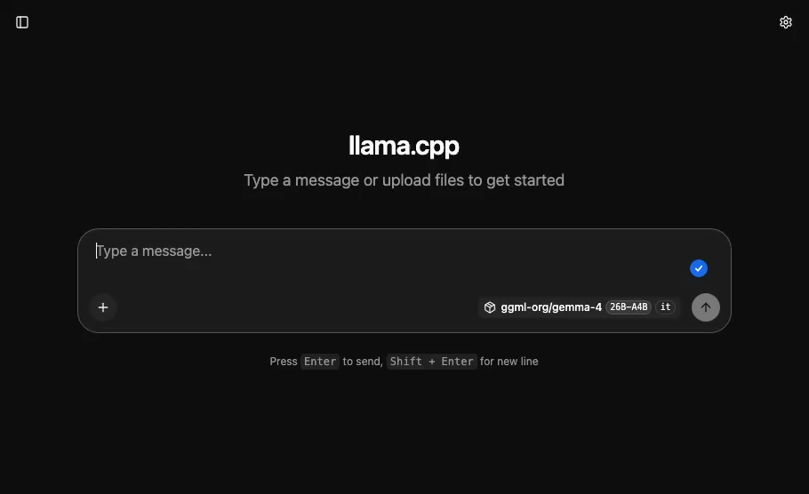
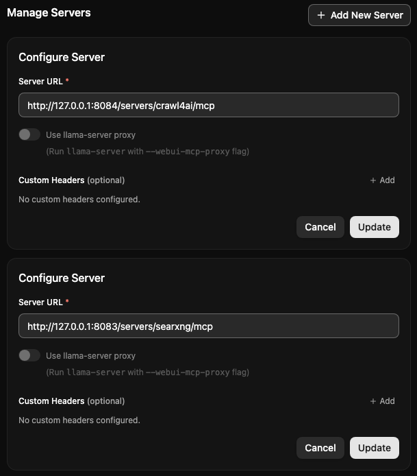
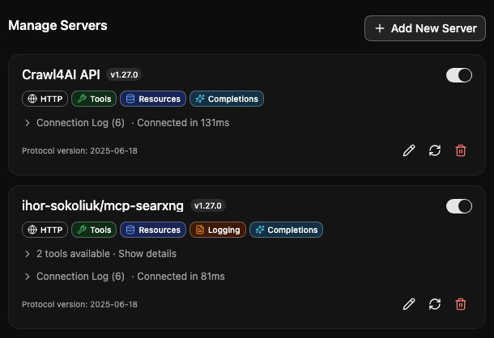

# 🕵️‍♂️ Local AI Research MCP Stack

> *A reproducible, fully local AI research stack that equips LLMs with real-time web search and deep-reading scraping capabilities.*

This stack leverages the **Model Context Protocol (MCP)** to integrate [SearXNG](https://github.com/searxng/searxng) for discovery and [Crawl4AI](https://github.com/unclecode/crawl4ai) for full-page Markdown extraction. This ensures the AI synthesizes answers from *real* sources—dramatically reducing hallucinations.



## 🤔 What is the Model Context Protocol (MCP)?

If you're unfamiliar, **MCP** is an open standard that allows AI models to securely connect to external tools and data sources. Instead of writing custom API wrappers for every individual LLM, MCP provides a universal "plug-and-play" interface. By exposing our tools (SearXNG and Crawl4AI) as MCP servers, models running on platforms like `llama.cpp` can automatically discover and use them without any custom integration code.

---

## 🛠️ Core Components

### 🦙 The Inference Engine: llama.cpp

I use [llama.cpp](https://github.com/ggml-org/llama.cpp) to host the local LLM. It is highly optimized for performance and provides state-of-the-art hardware acceleration (such as Apple's Metal for Mac GPUs), making it perfect for running large models smoothly on consumer hardware. Importantly, it comes with a built-in Web UI that natively supports adding MCP servers, allowing us to connect our tools directly without needing third-party frontends.

### 🧠 The Model: Gemma 4-26B (GGUF)

I recommend using the [ggml-org/gemma-4-26B-A4B-it-GGUF](https://huggingface.co/ggml-org/gemma-4-26B-A4B-it-GGUF) model, but you should check out the entire [Gemma 4 family models collection](https://huggingface.co/collections/ggml-org/gemma-4)).

- **What does A4B mean?** It signifies that out of the 26 Billion total parameters, only **4 Billion are active (A4B)** at any given time. This is a *Mixture of Experts (MoE)* architecture, providing the intelligence of a massive model with the **RAM** and speed requirements of a much smaller one.
- **What does GGUF mean?** GPT-Generated Unified Format (GGUF) is a highly optimized binary format designed specifically for fast loading and hardware-accelerated inference locally.

### 🔍 Discovery Tool: SearXNG

[SearXNG](https://github.com/searxng/searxng) is a privacy-respecting, open-source metasearch engine. Instead of relying on a single provider, it aggregates results from over 70 search engines. For this AI stack, it acts as the primary *discovery* engine, safely providing the model with real-time URLs and text snippets (like the current date).

### 🕷️ Reading Tool: Crawl4AI

[Crawl4AI](https://github.com/unclecode/crawl4ai) is a powerful, LLM-friendly web scraper. After SearXNG discovers a relevant link, the LLM can leverage Crawl4AI to fetch a given URL bypassing blockers, extracting the content, and returning clean, parseable Markdown.

---

## 🚀 Getting Started

### Step 1: Configure `.env` and Start the Infrastructure Stack

The project uses an included `.env` file to define the external ports for the Docker containers. This prevents conflicts with other services you might be running. By default, the `.env` file is configured as follows:

```env
SEARXNG_PORT=8081
CRAWL4AI_PORT=8082
MCP_SEARXNG_PORT=8083
MCP_CRAWL4AI_PORT=8084
```

You can safely modify these values if any of these ports are already in use on your machine.

Once you are happy with the port configuration, boot up the infrastructure stack:

```bash
# Clone the repository
git clone https://github.com/Nexer8/local-ai-research-mcp-stack.git
cd local-ai-research-mcp-stack

# Boot the tools in the background
docker compose up -d
```

To stop the stack, simply run:

```bash
docker compose down
```

### Step 2: Install and Run llama.cpp

On macOS, you can quickly install `llama.cpp` using Homebrew:

```bash
brew install llama.cpp
```

*(For Windows/Linux, see the official [llama.cpp installation guide](https://github.com/ggml-org/llama.cpp)).*

Next, start the LLM server. It will automatically download the GGUF model from HuggingFace on the first run:

```bash
llama-server -hf ggml-org/gemma-4-26B-A4B-it-GGUF --port 8080
```

### Step 3: Configure your MCP Servers in llama.cpp

The `llama.cpp` server comes with a powerful built-in Web UI that natively supports MCP servers over Server-Sent Events (SSE). Once your server has booted, open its Web UI (usually at `http://127.0.0.1:8080`) in your browser.

Navigate to the **Manage Servers** section, click **Add New Server**, and add the following two endpoints to attach your local Docker tools:

1. **SearXNG URL:** `http://127.0.0.1:8083/servers/searxng/mcp/`
2. **Crawl4AI URL:** `http://127.0.0.1:8084/servers/crawl4ai/mcp`

Pasting the server URLs should look like this:



After adding both endpoints, you will see them populate in your server list. Ensure the toggle switch is turned on.



### Step 4: The System Prompt

Open-source models can get easily confused when juggling multiple tools. To prevent the model from scraping search engine homepages or hallucinating URLs, configure your agent with the following strict System Prompt.

In the built-in Web UI, navigate to **Settings -> General -> System Message** and paste the following:

```text
You are a web-research AI equipped with two distinct tools:
1. Search Tool (SearXNG): Used for querying keywords to discover URLs.
2. Read Tool (Crawl4AI `md`): Used for extracting the full text of a webpage.

CRITICAL RULES TO PREVENT ERRORS:
1. NEVER INVENT URLS: You are strictly forbidden from guessing, constructing, or creating URLs (e.g., NEVER use "google.com/search?q=...").
2. DO NOT SCRAPE SEARCH ENGINES: NEVER pass a search engine URL (Google, Bing, DuckDuckGo) to the `md` tool.
3. INJECTION ONLY: You may only use the `md` tool on URLs that were explicitly returned to you by your Search tool, or provided directly by the user.

YOUR REQUIRED WORKFLOW:
- STEP 0 (Establish Timeline): You do not know the current date. You MUST use the Search Tool (SearXNG) with the query "current date and time today". Read the small text snippets returned by the search tool—the date will be written in the results.
- STEP 1 (Discover): Call the Search tool using keyword phrases. Wait for the tool to return a list of URLs.
- STEP 2 (Select): Read the search results and pick the 1-3 most relevant URLs.
- STEP 3 (Read): Call the `md` tool using ONLY the exact URLs you got from Step 1.
- STEP 4 (Answer): Synthesize your final response based solely on the scraped text. 
Always provide links to your sources.
```
